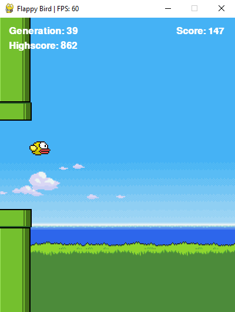

# Flappy Bird using Q-Learning

## Description
This project uses Q-Table algorithm to teach agent how to play flappy bird game.
Q-Table is a simple reinforcement learning algorithm, which chooses best action based on specified states. 
In this example there are 2 variables used as state, horizontal distance from bird to pipe, and vertical distance from bird to bottom pipe.
Actions available to agnet are either jump or don't jump.

### Built with
- Pygame
- Numpy

#### Example
After around 30 episodes, agent is capable of getting a decent score.

    

After some more training agent was able to jump through over 850+ consecutive pipes.

    

